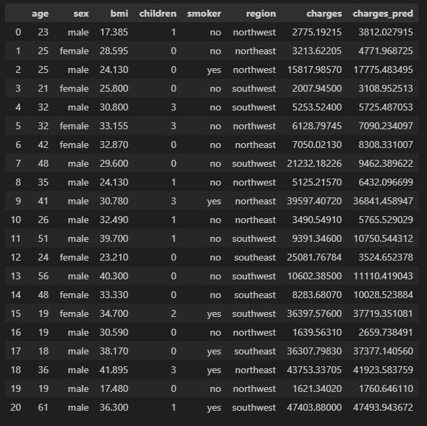
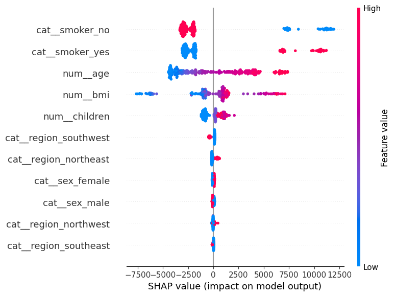

# ML Regression Project: Medical Cost Charges

## Project Background

The health insurance industry relies heavily on accurate risk assessment to ensure business sustainability and fair pricing for customers. Insurance companies are required to estimate future medical costs when determining insurance premiums. Inaccurate estimation may lead to financial losses if the actual medical expenses exceed the collected premiums, or to reduced competitiveness if the premiums are set too high for potential customers.

The Medical Cost Personal Dataset contains individual profile information such as age, sex, body mass index, number of children, smoking status, and residential region, along with the medical charges covered by insurance. These variables represent common risk factors that are widely considered in the insurance domain. For example, older age, higher body mass index, and smoking behavior are often associated with higher health risks and increased medical expenses. This indicates that personal and lifestyle profiles have a significant influence on the amount of insurance charges incurred by customers, making the dataset suitable for risk profiling analysis.

Based on this background, the application of machine learning using a regression approach becomes important to model the relationship between customer profiles and medical charges in a more systematic and data driven way. A regression model can help estimate expected medical costs for new customers while also providing insights into which factors contribute most to higher insurance charges. Therefore, the urgency of implementing a machine learning regression model in this case lies in its ability to support more accurate premium estimation, improve risk management, and enhance data based decision making in the health insurance industry.

## Methods Used

The experiment focuses on several boosting algorithms: 
- **K-Nearest Neighbors Regressor**
- **Linear Regression**
- **Ridge**
- **Lasso**
- **ElasticNet**
- **Random Forest Regressor**
- **XGBoost Regressor**
- **CatBoost Regressor**

------------------------------------------------------------------------

## Results

In the initial modeling phase, I used all candidate models to evaluate their performance in prediction and evaluation stages using Cross Validation and training data. Each model was optimized using its own hyperparameter tuning process to identify the best performing model. Among all evaluated models, the best performance, indicated by the lowest RMSE value, was achieved by three ensemble models, namely Random Forest, XGBoost, and CatBoost, with the following summary:

These three models were then used to perform prediction and evaluation on the test data. After that, the performance of the three models on the test dataset was obtained as follows:

Based on the test data results, the Random Forest model showed a tendency to overfit, which can be observed from the noticeable difference in RMSE between the training data and the test data, which represents unseen data. Meanwhile, XGBoost and CatBoost demonstrated better performance. However, CatBoost was selected as the final model because the RMSE gap between the training and test sets was smaller, indicating more consistent performance and better generalization on unseen data.

I also included a comparison between the actual insurance charges in the test data and the predicted values generated by the selected model.

In addition, I conducted an analysis to understand the contribution of each feature to the predicted insurance charges using SHAP (Shapley Additive Explanations). The results show that the most influential features are smoking status and age. Individuals who are non smokers tend to have lower medical charges compared to smokers. Meanwhile, increasing age, especially toward older age groups, shows a tendency to result in higher medical charges. This finding is reasonable, as older patients may have more complex medical conditions such as complications that require more expensive treatments. Similarly, smoking behavior, which is widely known to be harmful to health, is associated with higher medical charges, as reflected in the data where smokers consistently incur higher medical costs than non smokers.

------------------------------------------------------------------------

## Conclusion

In this project, there is a clear tendency that ensemble models perform better for regression tasks compared to commonly used models such as Linear Regression, even when regularization techniques like Lasso, Ridge, and Elastic Net are applied. Although the dataset used in this case can be considered relatively small, the main focus of this project is to observe whether ensemble models are able to perform well on a limited dataset. The results show that these models are still capable of achieving strong performance.

For future development, this project still has potential to be extended into a more concrete application, particularly through a deployment phase that can be accessed by end users. In this context, the system could be used by insurance companies as a decision support tool when determining annual insurance premiums based on customers’ medical history records.

------------------------------------------------------------------------

## Contact

Anyway, thanks for your attention in reading this readme until this final section. If you have any feedback towards this project, please feel free to contact me on bagaskoroah@gmail.com\
Thank you! :)
